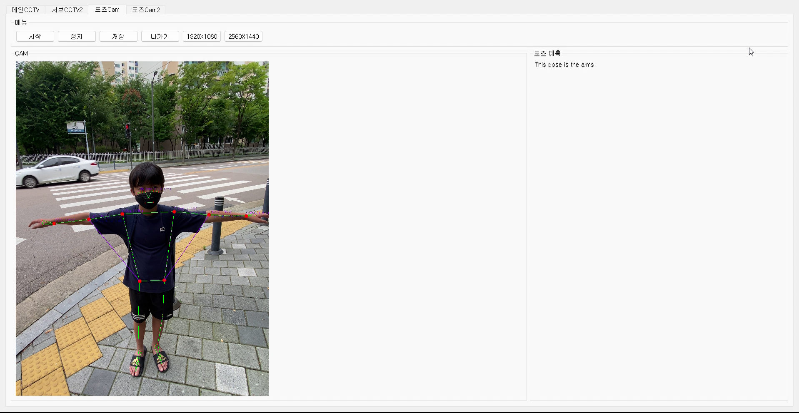
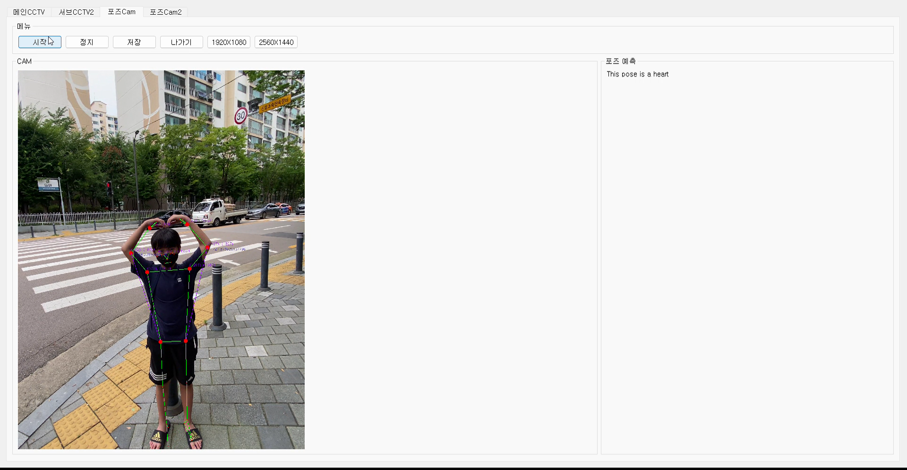
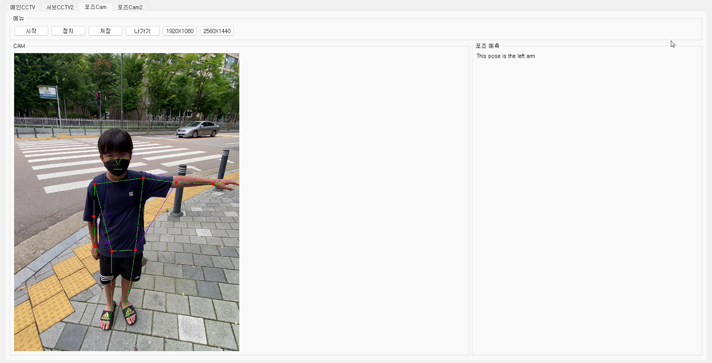
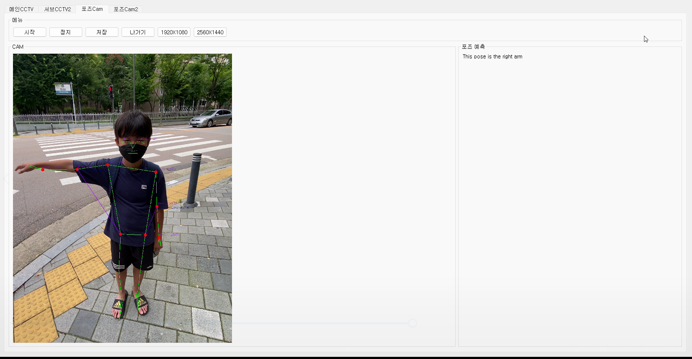

<p align=center>
</img>
<width="460" src="https://github.com/AI-Expert-04/AI-Expert-04/blob/main/.idea/ezgif.com-gif-maker.gif">
</p>

## 개발 의도
- 아이들을 지키기 위한 스쿨존에서 사고가 제일 많이 발생하여, 스쿨존 교통사고 예방은 어린이안전교육 확대가 우선이라고 생각하여 개발함.

## 문제점 분석
- 어린이안전교육이 부족하며, 현장에서 배우는 것이 아닌 이론으로 배우기 때문에 현장에서 사고가 많으며 돌발행동이 많음

## 개발
<table><tr><td valign="top" width="20%">
  
### Editor
<div align="center">
  Pycharm,
  Unity
</div>   
</td><td valign="top" width="20%">
  
### Language
<div align="center">
  Python,
  C#
</div>
</td><td valign="top" width="20%">
  
### learning method
<div align="center">
  Deep_learning,
  supervised learning,
  transfer learning
</div>   
</td><td valign="top" width="20%">

### AI Technology
<div align="center">
  Object Detection,
  Find Pose
</div>   
</td><td valign="top" width="20%">

### Optimizer
<div align="center">
  SGD, 
  Loss, 
  Box_loss, 
  Label_loss, 
  Nan방지
</div>  
</td></tr></table>

## 사용방법
git clone

deep learning 
### class
##### class.ymal
<pre><code>nc: 85:
  names: ['Kid', 'Adult', 'R_Signal', 'G_Signal', 'Cross' 'person', 'bicycle', 'car', 'motorcycle', 'airplane', 'bus', 
        'train', 'truck', 'boat', 'traffic light', 'fire hydrant', 'stop sign', 'parking meter', 'bench', 'bird', 'cat', 
        'dog', 'horse', 'sheep', 'cow', 'elephant', 'bear', 'zebra', 'giraffe', 'backpack', 'umbrella', 'handbag', 'tie', 
        'suitcase', 'frisbee', 'skis', 'snowboard', 'sports ball', 'kite', 'baseball bat', 'baseball glove', 'skateboard', 
        'surfboard', 'tennis racket', 'bottle', 'wine glass', 'cup', 'fork', 'knife', 'spoon', 'bowl', 'banana', 'apple',
        'sandwich', 'orange', 'broccoli', 'carrot', 'hot dog', 'pizza', 'donut', 'cake', 'chair', 'couch', 'potted plant', 
        'bed', 'dining table', 'toilet', 'tv', 'laptop', 'mouse', 'remote', 'keyboard', 'cell phone', 'microwave', 'oven', 
        'toaster', 'sink', 'refrigerator', 'book', 'clock', 'vase', 'scissors', 'teddy bear', 'hair drier', 'toothbrush']  # class names </code></pre>

yolov5 model weight를 전이학습시켜
## 파일구조
```
CCTV_Detecter
 |---- yolov5
 |    |---- Name_Models
 |    |    |---- Kid_Adult
 |    |    |    |---- Kid_Adult_best (1).pt  -> 어린이_어른 구별 모델
 |    |    |    |---- Kid_Adult_best.pt
 |    |    |    |---- Kid_Adult_last.pt
 |    |    |---- Object
 |    |    |    |---- Object.pt -> 자동차, 버스, 트럭, 사람 감지 모델
 |    |    |---- light
 |    |    |    |---- light_best.pt -> 도로, 빨간불, 파란불 감지 모델
 |    |    |    |---- light_last.pt
 |    |---- Name_Yaml
 |    |    |---- Kid_Adult
 |    |    |    |---- Kid_Adult_data.yaml -> class_name[어린이, 어른]
 |    |    |    |---- Kid_Adult_data2.yaml
 |    |    |---- Object
 |    |    |    |---- Object.yaml -> class_name[자동차, 버스, 트럭, 사람]
 |    |    |---- light
 |    |    |    |---- light_data.yaml -> class_name[도로, 빨간불, 파란불]
 |    |---- mp3file
 |    |    |    |---- bick.mp3--------|
 |    |    |    |---- fcar.mp3--------|________ 상황에 맞는 소리
 |    |    |    |---- kick-bick.mp3---|
 |    |    |    |---- kick.mp3--------|
 |    |---- CCTV_Detecter.py -----| 객체인식 코드
 |    |---- GUI.py ---------------| GUI 코드
 Pose Model
 |---- mp3-flie
 |    |    |    |---- blue.mp3------------|
 |    |    |    |---- hello_school.mp3----|________ 상황에 맞는 소리
 |    |    |    |---- left.mp3-------|
 |    |    |    |---- right.mp3------------|
 |---- Finall.py -----| 포즈 감지 코드
```

Pyhon 코드 파일

`CCTV_Detecter.py`
객체인식 + 포즈인식


##  결과
</img>
</img>
</img>
</img>


## 추가 예정
계절 및 날씨에 따른 결과들을 분석으로 상황에 맞는 인공지능을 만들 계획
예) 비가오는 날이면, 우산을 인식함.

</p>
